# Azure Health Monitor 🏥📊

**Keep track of your Azure services and get notified when something might affect your business**

## What Does This Do? 🤔

Imagine you have several applications running on Microsoft Azure (like websites, databases, or storage). Sometimes Azure has service issues that could affect your applications. This tool:

1. **Automatically checks** what Azure services you're actually using
2. **Monitors Azure's health reports** for any problems
3. **Only alerts you** about issues that could affect YOUR specific services
4. **Runs automatically** every day so you don't have to remember to check

Think of it like having a smart assistant that watches the news for traffic problems, but only tells you about the roads you actually drive on.

## Why Is This Helpful? 💡

- **Stay Informed**: Know about potential issues before they impact your business
- **Reduce Noise**: Only get alerts about problems that actually matter to you
- **Save Time**: No need to manually check Azure service health every day
- **Be Proactive**: Address potential issues before customers notice them

## Visual Workflow 📋

```mermaid
graph TD
    A[⏰ Daily Timer Trigger<br/>8:00 AM UTC] --> B[🔐 Connect to Azure<br/>using Managed Identity]
    B --> C[📋 Scan Your Subscription<br/>Find all your resources]
    C --> D[🗺️ Identify Regions<br/>Where you have resources]
    D --> E[🔍 Check Azure Service Health<br/>Look for warnings & critical issues]
    E --> F{🎯 Filter Issues<br/>Does this affect<br/>your services?}
    F -->|Yes| G[⚠️ Create Alert<br/>Log important issue]
    F -->|No| H[✅ Ignore<br/>Not relevant to you]
    G --> I[💾 Save Results<br/>Store in blob storage]
    H --> I
    I --> J[📧 Send Notifications<br/>If issues found]
    J --> K[📊 Update Monitoring<br/>Application Insights]
    
    style A fill:#e1f5fe
    style B fill:#f3e5f5
    style C fill:#e8f5e8
    style D fill:#fff3e0
    style E fill:#fce4ec
    style F fill:#fff8e1
    style G fill:#ffebee
    style H fill:#e8f5e8
    style I fill:#f1f8e9
    style J fill:#e3f2fd
    style K fill:#f9fbe7
```



## What Gets Monitored? 🔍

### Resource Types Tracked 📋
This system automatically inventories **ALL** resources in your Azure subscription, including but not limited to:

**Compute Services:**
- Virtual Machines (VMs)
- Virtual Machine Scale Sets
- App Services (Web Apps)
- Function Apps
- Container Instances
- Kubernetes Services (AKS)
- Azure Batch
- Service Fabric

**Storage & Databases:**
- Storage Accounts (Blob, File, Queue, Table)
- SQL Databases & Managed Instances
- Cosmos DB
- Azure Database for MySQL/PostgreSQL
- Redis Cache
- Azure Synapse Analytics

**Networking:**
- Virtual Networks (VNets)
- Load Balancers
- Application Gateways
- VPN Gateways
- Network Security Groups
- Traffic Manager
- Front Door
- CDN

**AI & Analytics:**
- Cognitive Services
- Machine Learning workspaces
- Stream Analytics
- Data Factory
- Event Hubs
- Service Bus

**Security & Identity:**
- Key Vaults
- Azure Active Directory resources
- Application Insights
- Log Analytics workspaces

**And Many More:**
- Logic Apps, API Management, Event Grid, IoT Hubs, Power BI, etc.

### Service Health Events Monitored ⚠️

**Event Severity Levels:**
- **🔴 Critical**: Service completely unavailable or major functionality broken
- **🟡 Warning**: Performance degradation, intermittent issues, or planned maintenance
- **🔵 Information**: General announcements that don't affect service availability

**Types of Health Events Tracked:**
1. **Service Outages**: Complete service unavailability
2. **Performance Degradation**: Slower response times or reduced throughput
3. **Connectivity Issues**: Problems accessing services
4. **Authentication Problems**: Sign-in or permission issues
5. **Feature Disruptions**: Specific features not working properly
6. **Planned Maintenance**: Scheduled updates that might cause brief interruptions
7. **Regional Issues**: Problems affecting specific Azure regions
8. **Deployment Failures**: Issues with deploying or updating resources

**Smart Filtering Logic:**
The system only alerts you about events that meet ALL these criteria:
- ✅ **Severity**: Critical or Warning level (ignores minor informational messages)
- ✅ **Geography**: Affects regions where you actually have resources deployed
- ✅ **Services**: Impacts service types you're actually using
- ✅ **Timeline**: Current or recent events (not historical issues)

**Example Filtering in Action:**
- ❌ **Filtered OUT**: "SQL Database issues in Japan East" (you have no resources in Japan)
- ❌ **Filtered OUT**: "IoT Hub connectivity problems" (you don't use IoT Hub)
- ✅ **Alert Sent**: "Web Apps slow response times in East US" (you have 3 App Services there)

### What You'll See in Reports 📊

**Resource Inventory Summary:**
```json
{
  "TotalResources": 42,
  "ResourceTypes": {
    "Microsoft.Web/sites": 8,           // App Services
    "Microsoft.Sql/servers": 3,         // SQL Databases  
    "Microsoft.Storage/storageAccounts": 5,
    "Microsoft.Compute/virtualMachines": 2,
    "Microsoft.KeyVault/vaults": 1,
    // ... etc
  },
  "RegionDistribution": {
    "eastus": 25,
    "westus2": 12,
    "canadacentral": 5
  }
}
```

**Health Event Details:**
```json
{
  "HealthEvents": [
    {
      "EventId": "ABC123",
      "Level": "Warning",
      "Title": "Intermittent connectivity issues affecting App Service",
      "Description": "Some customers may experience connection timeouts...",
      "ImpactedServices": ["App Service", "Function Apps"],
      "ImpactedRegions": ["East US", "East US 2"],
      "StartTime": "2025-06-10T14:30:00Z",
      "LastUpdate": "2025-06-10T16:45:00Z",
      "Status": "Active"
    }
  ]
}
```

### Monitoring Frequency ⏰

**Daily Inventory Scan:**
- Runs every day at 8:00 AM UTC
- Takes ~30 seconds to complete
- Scans your entire subscription
- Identifies all resource types and their locations

**Real-time Health Monitoring:**
- Checks Azure Service Health status during each run
- Looks for events from the past 24 hours
- Filters events based on your actual resource footprint
- Generates alerts only for relevant issues

**Historical Tracking:**
- Maintains 30+ days of resource inventory history
- Tracks changes in your resource usage over time
- Preserves health event records for trend analysis
- Stores all data in your Azure Storage account

### Email Notification Content 📧

When health issues are detected, you'll receive detailed email notifications containing:

**Subject Line Format:**
```
🚨 Azure Health Alert: [Severity] issues detected affecting your resources
```

**Email Body Includes:**
- **Executive Summary**: Quick overview of what's happening
- **Affected Resources**: List of your specific resources that might be impacted
- **Issue Details**: Description of the problem and expected impact
- **Geographic Scope**: Which regions are affected
- **Recommendation**: Suggested actions or monitoring steps
- **Timestamp**: When the issue was detected and last updated

**Example Email Alert:**
```
🚨 Azure Health Alert: Warning issues detected affecting your resources

Summary:
- 1 Warning-level issue found
- Potentially affecting 3 of your App Services in East US
- Issue detected: 2025-06-10 at 2:30 PM UTC

Issue Details:
Title: Intermittent connectivity issues affecting App Service
Severity: Warning
Affected Services: App Service, Function Apps
Affected Regions: East US, East US 2

Your Potentially Impacted Resources:
- my-web-app-prod (App Service, East US)
- my-api-service (App Service, East US)  
- my-function-app (Function App, East US)

Recommended Actions:
1. Monitor your applications for connectivity issues
2. Check Application Insights for error rate increases
3. Consider temporary traffic routing to other regions if needed

This alert was generated by your Azure Health Monitor function.
Full details saved to your storage account for review.
```

## What You'll Get 📦

### 🏗️ Infrastructure (Automatically Created)
- **Function App**: The "brain" that runs your monitoring code
- **Storage Account**: Keeps historical records of what was found
- **Application Insights**: Detailed logs for troubleshooting
- **Key Vault**: Secure storage for sensitive settings
- **Managed Identity**: Secure way to access Azure without passwords

### 📊 Daily Reports & Alerts
Every day, you'll get information about:
- How many resources you have running
- Which regions (locations) you're using
- Any Azure service problems that might affect you
- Historical trends stored for future reference
- **Optional Email Notifications**: Get immediate alerts when health issues are detected

### 📧 Email Notification Features
- **Automatic Alerts**: Receive emails when critical or warning issues are detected
- **Smart Filtering**: Only get notified about issues affecting YOUR resources
- **Rich Content**: Detailed email reports with issue descriptions and affected services
- **Secure Storage**: Email content is also saved to blob storage for review
- **Easy Setup**: Configure during deployment with email validation

## Quick Start Guide 🚀

### What You Need Before Starting
- An Azure account with permission to create resources
- About 15-30 minutes for setup
- Basic familiarity with Azure portal (we'll guide you!)

### Step 1: Get the Code
```bash
# Download the project files to your computer
cd your-projects-folder
# (Files should already be in your AzureHealthMonitor folder)
```

### Step 2: Deploy to Azure

**🎯 Recommended Option - Use Our PowerShell Script:**
```powershell
# Open PowerShell and navigate to the project folder
cd AzureHealthMonitor

# Run our deployment script (manual deployment - most reliable)
.\Deploy.ps1
```

The deployment script will ask if you want to receive email notifications:
- **Answer 'y'** if you want email alerts when health issues are detected
- **Provide your email address** when prompted
- **Answer 'n'** if you prefer to check reports manually

**🔧 Alternative - Try Azure Developer CLI (with fallback):**
```powershell
# Note: Azure Developer CLI doesn't fully support PowerShell functions
# This will attempt azd deployment but fall back to manual if needed
.\Deploy.ps1 -TryAzd $true
```

**ℹ️ Important Note about Azure Developer CLI:**
Azure Developer CLI (`azd`) doesn't natively support PowerShell Azure Functions. While we've configured it for compatibility, the deployment will automatically fall back to manual deployment using Azure PowerShell and Azure CLI. This is completely normal and expected.

### Step 3: What Happens During Deployment
The script will automatically:
1. ✅ Check your authentication and tools
2. ✅ Create a resource group called "AzureCustomHealthStatus" 
3. ✅ Deploy infrastructure using Bicep templates
4. ✅ Set up all the necessary Azure services
5. ✅ Configure security permissions (Managed Identity)
6. ✅ Deploy the PowerShell monitoring code
7. ✅ Schedule daily health checks

**⏱️ Expected time: 10-15 minutes**

**🛠️ Prerequisites Check:**
- Azure PowerShell (Install-Module -Name Az)
- Azure CLI (optional, but recommended for function deployment)
- Appropriate permissions in your Azure subscription

## How to Use After Setup 📱

### Viewing Your Daily Health Reports

**🌐 Azure Portal Method (if having access issues, try the solutions below):**

1. **Primary Method:**
   - Go to [portal.azure.com](https://portal.azure.com)
   - Navigate to your "AzureCustomHealthStatus" resource group
   - Click on the Function App "azure-health-monitor"
   - Check "Functions" → "HealthMonitorFunction" for execution history

2. **If you get "Resource not found" error, try these solutions:**

   **Solution A - Direct URL Access:**
   ```
   https://portal.azure.com/#view/WebsitesExtension/FunctionMenuBlade/~/Overview/resourceId/%2Fsubscriptions%2F64e4567b-012b-4966-9a91-b5c7c7b992de%2FresourceGroups%2FAzureCustomHealthStatus%2Fproviders%2FMicrosoft.Web%2Fsites%2Fazure-health-monitor
   ```

   **Solution B - Portal Search:**
   - Use the search bar at the top of Azure Portal
   - Search for "azure-health-monitor"
   - Select the Function App from search results

   **Solution C - Clear Portal Cache:**
   - Press `Ctrl + F5` to hard refresh the portal
   - Or try incognito/private browsing mode
   - Wait 10-15 minutes for portal cache to refresh

3. **Alternative - All Resources View:**
   - Go to "All Resources" in the Azure Portal
   - Filter by resource group "AzureCustomHealthStatus"
   - Find "azure-health-monitor" Function App

2. **Storage Reports:**
   - In the same resource group, find the Storage Account
   - Look in the "logs" container
   - Files are named like: `health-monitor/2025-06-10-080000-results.json`

3. **Application Insights:**
   - Find "Application Insights" in your resource group
   - View detailed logs and execution timelines

### Understanding Your Reports 📖

**Sample Daily Report:**
```json
{
  "Summary": {
    "TotalResources": 25,        // You have 25 Azure services running
    "ResourceTypes": 6,          // Across 6 different types (web apps, databases, etc.)
    "UsedRegions": 2,           // In 2 geographic regions
    "HealthIssues": 1,          // 1 potential issue found
    "CriticalIssues": 0,        // No critical problems
    "WarningIssues": 1          // 1 warning-level issue
  },
  "HealthEvents": [
    {
      "Title": "Service slowness in East US",
      "Level": "Warning",
      "ImpactedServices": ["Web Apps"],
      "ImpactedRegions": ["eastus"],
      "Description": "Some web applications may experience slower response times"
    }
  ]
}
```

**What This Means:**
- ✅ Most of your services are healthy
- ⚠️ There's a minor slowness issue affecting web apps in East US
- 🎯 You only got alerted because you actually have web apps in that region

## Customization Options ⚙️

### Change When It Runs
Edit the schedule in `src/HealthMonitorFunction/function.json`:
- `"0 0 8 * * *"` = Daily at 8:00 AM
- `"0 0 */6 * * *"` = Every 6 hours  
- `"0 0 8 * * 1-5"` = Weekdays only at 8:00 AM

### Add Email Notifications
You can extend the solution to send emails by:
1. Setting up Azure Logic Apps
2. Connecting to Microsoft Teams
3. Using Azure Monitor Action Groups
4. Integrating with your existing notification systems

### Monitor Different Subscription
To monitor a different Azure subscription:
1. Go to your Function App in the Azure portal
2. Find "Configuration" → "Application Settings"
3. Update `PREFERRED_SUBSCRIPTION_ID` with the target subscription ID

## Cost Information 💰

**Expected Monthly Cost: $5-15 USD**

**What You Pay For:**
- Function execution (runs once daily ~30 seconds) = ~$1-2
- Storage for historical reports = ~$1-3  
- Application Insights logging = ~$2-5
- Other services (minimal usage) = ~$1-5

**Cost-Saving Tips:**
- The solution uses "pay-as-you-go" services
- You only pay when it actually runs
- Storage costs grow slowly over time
- Can be turned off anytime without data loss

## Troubleshooting 🔧

### Common Deployment Issues

**❓ "Azure Portal shows 'Resource not found' for Function App"**
- ✅ **This is a portal caching issue** - the resources exist and are working
- **Quick Fix**: Use the direct URLs provided in the "Viewing Reports" section above
- **Alternative**: Search for "azure-health-monitor" in the Azure Portal search bar
- **Cache Clear**: Press `Ctrl + F5` to refresh, or wait 10-15 minutes for cache refresh
- **Verify**: Resources are deployed and running (confirmed by CLI commands)

**❓ "Azure Developer CLI deployment failed"**
- ✅ **This is normal!** Azure Developer CLI doesn't support PowerShell functions
- The deployment script automatically falls back to manual deployment
- Look for "Falling back to manual deployment..." message - this is expected

**❓ "Quota exceeded" or "Not enough resources"**
- Try a different Azure region: `.\Deploy.ps1 -Location "westus2"`
- Use a different subscription with available quota
- Request a quota increase from Microsoft Azure support

**❓ "Function deployment failed"**
- Ensure Azure CLI is installed and authenticated
- You can manually deploy via Azure Portal if needed
- Check the deployment script output for specific guidance

**❓ "Permission denied" errors**
- Ensure you have Contributor or Owner role in the subscription
- Check if your subscription has restrictions on creating resource groups
- Wait 10-15 minutes after deployment for permissions to propagate

### Runtime Issues

**❓ "I don't see any reports after deployment"**
- Wait 24 hours for the first automatic run (8:00 AM UTC)
- Manually trigger the function: Azure Portal → Function App → Functions → Test/Run
- Check Application Insights for execution logs

**❓ "I'm getting too many/too few alerts"**
- Modify severity levels in `src/HealthMonitorFunction/run.ps1`
- Adjust which resource types to monitor in the PowerShell code
- Change geographic region filters

**❓ "The function shows errors in logs"**
- Check if the Managed Identity has proper permissions (wait 15 minutes after deployment)
- Verify your subscription has resources to monitor
- Look for specific error messages in Application Insights

### Self-Help Diagnostic Commands
```powershell
# Check if your deployment completed successfully
Get-AzResourceGroup -Name "AzureCustomHealthStatus"

# View function app status
Get-AzFunctionApp -ResourceGroupName "AzureCustomHealthStatus"

# Test Azure PowerShell authentication
Get-AzContext
Get-AzSubscription
```


### When to Get Additional Help
1. The deployment completes but shows consistent runtime errors after 24 hours
2. You need to customize the monitoring for specific business requirements
3. You want to integrate with your existing notification systems (email, Teams, etc.)

## Security & Privacy 🔒

**How We Keep Your Data Safe:**
- ✅ **No Passwords Stored**: Uses Azure Managed Identity (like a secure digital ID card)
- ✅ **Minimal Permissions**: Only gets the minimum access needed to do its job
- ✅ **Encrypted Storage**: All data is encrypted both in transit and at rest
- ✅ **Private Access**: Your data stays in your Azure account, never shared
- ✅ **Audit Trail**: Complete logs of what the system accessed and when

## What Happens Behind the Scenes 🎭

**Every day at 8:00 AM UTC, here's what happens:**

1. **🔐 Secure Login**: The system logs into Azure using its secure digital identity
2. **📊 Resource Scan**: Looks through your subscription to see what services you have
3. **🗺️ Region Mapping**: Notes which geographic regions your services are in
4. **🔍 Health Check**: Queries Azure's official service health reports
5. **🎯 Smart Filter**: Compares health issues against your actual services and locations
6. **📝 Report Generation**: Creates a detailed report of relevant findings
7. **💾 Data Storage**: Saves the report for historical tracking
8. **📢 Alert Generation**: Creates notifications if issues are found (you can customize this)
9. **📊 Monitoring Update**: Logs everything for troubleshooting and improvement

**The whole process takes about 30 seconds and runs completely automatically.**

## Support & Updates 🤝

This solution is designed to be:
- **Self-maintaining**: Automatically handles Azure service updates
- **Reliable**: Built using Microsoft's recommended practices
- **Extensible**: Easy to modify for your specific needs
- **Documented**: Comprehensive logs help with any issues

Remember: This tool helps you stay informed about potential issues, but it doesn't fix problems automatically. Think of it as an early warning system that helps you be proactive about managing your Azure services.

---

*Need help or have suggestions? The Application Insights logs contain detailed information about every execution, and the blob storage maintains a complete history of all findings.*
