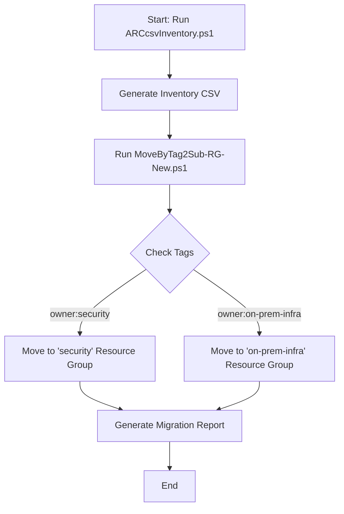

# Azure Arc Server Migration Scripts

## Overview

This folder contains PowerShell scripts and related files for managing and migrating Azure Arc-enabled servers across subscriptions and resource groups based on specific tags. The scripts automate the process of inventory generation, tag-based filtering, and server migration.

## Files

### 1. `ARCcsvInventory.ps1`
Generates a CSV inventory of Azure Arc-enabled servers. The inventory includes details such as server name, resource group, location, status, OS type, Arc agent version, and tags.

### 2. `MoveByTag2Sub-RG-New.ps1`
Migrates Azure Arc-enabled servers to different subscriptions and resource groups based on their tags. Supports dynamic column mapping and Azure data enrichment for missing information.

### 3. `Inventory.csv`
A sample or generated inventory file containing details of Azure Arc-enabled servers.

### 4. `ArcServerMigration_Report_20250605_154028.csv`
A detailed report of the migration process, including the status of each server (success, skipped, or failed).

### 5. `ArcServerMigration_20250605_154028.log`
A log file capturing detailed information about the migration process, including errors and warnings.

## Workflow



## Usage

### Generating Inventory
Run the `ARCcsvInventory.ps1` script to generate an inventory of Azure Arc-enabled servers:
```powershell
.\ARCcsvInventory.ps1
```

### Running the Script

### Use the most recent CSV file automatically
```powershell
.\MoveByTag2Sub-RG-New.ps1
```
### Or specify a CSV file path
```powershell
.\MoveByTag2Sub-RG-New.ps1 -CsvPath "C:\Path\To\Your\CSV.csv"
```
### Or specify both CSV path and target subscription
```powershell
.\MoveByTag2Sub-RG-New.ps1 -CsvPath "C:\Path\To\Your\CSV.csv" -TargetSubscriptionName "Your Target Sub"
```