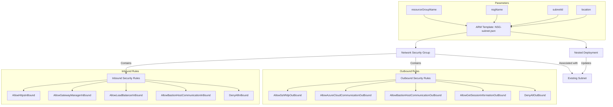

# Network Security Group Deployment Template

This template deploys a Network Security Group (NSG) with predefined security rules and associates it with an existing subnet in a specified resource group.

## Template Overview

The template creates the following resources:
1. Network Security Group with Bastion-compatible security rules
2. Association of the NSG with an existing subnet

## Architecture Diagram



## Parameters

| Parameter | Description |
|-----------|-------------|
| resourceGroupName | Name of the existing resource group where the subnet is located |
| nsgName | Name of the Network Security Group to create |
| subnetId | Resource ID of the existing subnet to associate with the NSG |
| location | Azure region for NSG |

## Deployment

To deploy this template:

```bash
az deployment group create \
  --resource-group myResourceGroup \
  --template-file NSG-subnet.json \
  --parameters \
    resourceGroupName="myResourceGroup" \
    nsgName="BastionNSG" \
    subnetId="/subscriptions/00000000-0000-0000-0000-000000000000/resourceGroups/myResourceGroup/providers/Microsoft.Network/virtualNetworks/myVnet/subnets/mySubnet" \
    location="eastus"
```

## Output

- **nsgId**: Resource ID of the created Network Security Group
