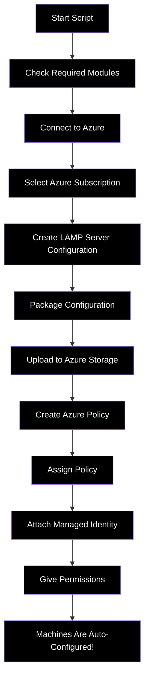

# LAMP Server Configuration using PowerShell DSC

This directory contains a PowerShell script that helps set up a LAMP (Linux, Apache, MySQL, PHP) server configuration on Linux computers in Azure.

## What This Script Does - Simple Explanation

Imagine you need to set up many Linux computers with the same web server software. Instead of installing the software on each computer one by one, this script creates a "recipe" that Azure can use to automatically configure all your computers.

### How It Works



### Step by Step Process:

1. **Install Required Tools**: The script checks if you have all the necessary tools and installs them if needed.

2. **Connect to Azure**: The script helps you sign in to your Azure account.

3. **Choose Your Subscription**: It shows a list of your subscriptions so you can pick which one to use.

4. **Create Configuration**: The script creates a "recipe" for a LAMP server that includes:
   - Apache web server
   - MariaDB (similar to MySQL)
   - PHP

5. **Package Configuration**: The "recipe" is packaged into a special file that Azure can understand.

6. **Upload to Azure**: The package is uploaded to Azure Storage so it can be accessed by all your computers.

7. **Create Policy**: The script creates an Azure Policy that says "all Linux computers should have this configuration."

8. **Assign Policy**: You choose which groups of computers should follow this policy.

9. **Set Permissions**: The script sets up the necessary permissions so that Azure can apply the configuration.

10. **Auto-Configuration**: Now Azure will automatically configure all your Linux computers according to your "recipe"!

## Technical Details

### Required PowerShell Modules

| Module Name | Description | Installation Command |
|-------------|-------------|----------------------|
| Az.Accounts | Azure PowerShell module for authentication and subscription management | `Install-Module -Name Az.Accounts -Force -AllowClobber` |
| PSDesiredStateConfiguration | Core DSC module that enables the `Import-DSCResource` functionality | `Install-Module -Name PSDesiredStateConfiguration -Force -AllowClobber` |
| GuestConfiguration | Module for creating and managing guest configurations in Azure | `Install-Module -Name GuestConfiguration -Repository PSGallery -Force -AllowClobber` |
| nx | Linux DSC resources for managing packages, services, files, etc. | `Install-Module -Name nx -Repository PSGallery -Force -AllowClobber` |
| PSDscResources | Additional DSC resources | `Install-Module -Name PSDscResources -Repository PSGallery -Force -AllowClobber` |

### Installation Script

You can use the following PowerShell script to install all the required modules:

```powershell
# Install required modules
Install-Module -Name Az.Accounts -Force -AllowClobber
Install-Module -Name PSDesiredStateConfiguration -Force -AllowClobber
Install-Module -Name GuestConfiguration -Repository PSGallery -Force -AllowClobber
Install-Module -Name nx -Repository PSGallery -Force -AllowClobber
Install-Module -Name PSDscResources -Repository PSGallery -Force -AllowClobber
```

> Note: The script will automatically check for required modules and prompt you to install them if they're missing.

### Azure Permissions Required

To run this script successfully, you need the following Azure permissions:

1. **Subscription or Resource Group Contributor** - To create storage accounts and policy assignments
2. **Role Assignment Permissions** - To assign roles to the policy assignment's managed identity
3. **Policy Contributor** - To create and assign policy definitions

### What's Inside the Configuration Package?

The LAMP Server configuration ensures:

1. **Software is Installed**:
   - httpd (Apache web server)
   - mod_ssl (for secure websites)
   - php (programming language for websites)
   - php-mysqlnd (connects PHP to the database)
   - mariadb (database server)
   - mariadb-server (database management)

2. **Services are Running**:
   - Apache web server is active
   - MariaDB database is active

### How the Azure Policy Works

The Azure Policy:
- Checks if any Linux computers are missing the required software
- Automatically installs the missing software
- Makes sure the services are running
- Works on both Azure VMs and computers connected via Azure Arc

## How to Use This Script

1. Run `LAMPServer.ps1` in PowerShell
2. Follow the prompts to:
   - Install any missing modules
   - Sign in to Azure
   - Select your Azure subscription
   - Choose where to store the configuration package
   - Select which computers should receive the configuration

After running the script, Azure will automatically configure all the selected computers with the LAMP server software!

## Azure Arc Integration

The configuration also works with on-premises Linux servers that are connected to Azure through Azure Arc. The policy is set up to include these machines automatically.

## Benefits

- **Consistency**: All servers have exactly the same configuration
- **Automation**: No need to manually configure each server
- **Compliance**: Automatically fixes any server that's not configured correctly
- **Scale**: Works with one server or thousands of servers
