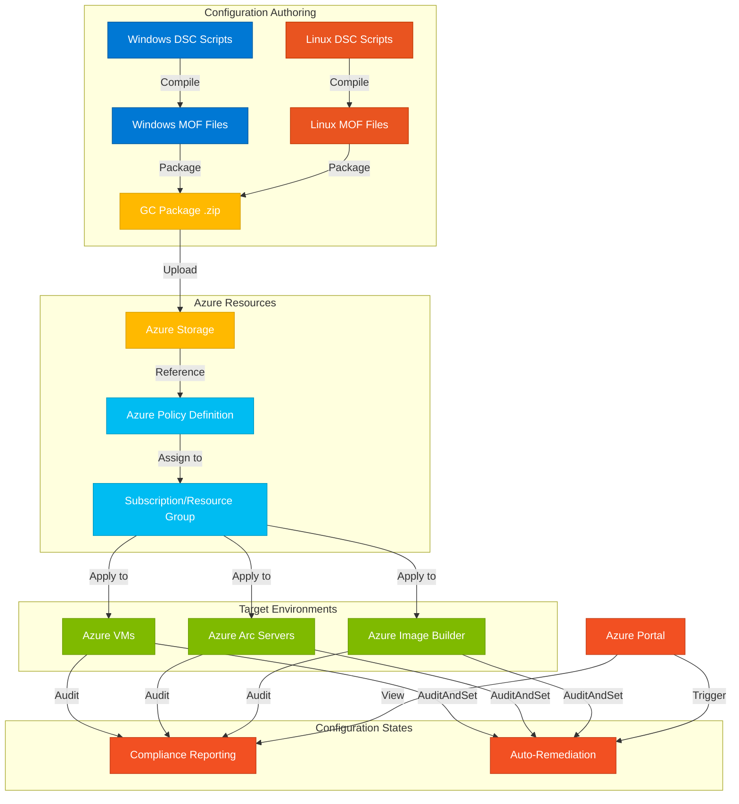

# Azure Machine Configuration Framework

This repository contains tools and scripts for implementing and managing Azure Machine Configuration (formerly known as Azure Guest Configuration) across different operating systems. The framework provides consistent configuration, compliance monitoring, and automatic remediation capabilities for both Azure VMs and Azure Arc-enabled servers.

# [Supported client types](https://learn.microsoft.com/en-us/azure/governance/machine-configuration/overview#supported-client-types)

## Project Overview

Azure Machine Configuration is a policy-as-code framework that allows administrators to define, enforce, and monitor the configuration state of Windows and Linux machines. This repository includes implementation examples for both Windows and Ubuntu Linux, demonstrating how to:

1. Create custom configuration policies using PowerShell DSC
2. Package configurations for deployment
3. Test configurations locally
4. Deploy configurations as Azure Policies
5. Integrate with Azure Image Builder for building compliant VM images

## Repository Structure

```
MachineConfig/
├── Windows/ - Windows-specific configuration scripts and documentation
├── Ubuntu/ - Ubuntu Linux configuration scripts and documentation
├── RHEL/ - Red Hat Enterprise Linux configuration scripts (TBD)
├── BackUP/ - Backup configurations and templates
```

## Solution Architecture

The following diagram illustrates the overall architecture and workflow of the Azure Machine Configuration framework:



## Key Features

### Windows Configuration

The Windows implementation focuses on:
- Creating custom DSC configurations for Windows settings (e.g., Time Zone)
- Packaging and testing configurations locally
- Publishing configurations as Azure Policies with auto-remediation capabilities
- Supporting private blob storage with managed identities

See the [Windows readme](./Windows/Readme.md) for detailed implementation steps.

### Ubuntu LAMP Configuration

The Ubuntu implementation demonstrates:
- Using PowerShell DSC to deploy a complete LAMP stack (Linux, Apache, MySQL, PHP)
- Automating the configuration of web server environments
- Enforcing compliance through Azure Policy

See the [Ubuntu readme](./Ubuntu/README.md) for detailed implementation steps.

## Getting Started

### Prerequisites

- Azure subscription with appropriate access rights
- PowerShell 7+ with the GuestConfiguration module
- Required DSC resources for your target configurations
- Storage account for hosting configuration packages

### Azure Best Practices

When implementing Machine Configuration, consider these Azure best practices:

1. **Least Privilege Access**: Use managed identities with precise permissions instead of connection strings or shared keys
2. **Resource Naming**: Follow a consistent naming convention for all resources
3. **Resource Tagging**: Tag all resources with appropriate metadata (owner, environment, etc.)
4. **Configuration Versioning**: Version your configuration packages for tracking and rollback capability
5. **Testing Pipeline**: Test configurations thoroughly in non-production environments 
6. **Incremental Implementation**: Start with audit-only policies before enabling remediation
7. **Monitoring**: Set up alerting for compliance state changes

### Basic Implementation Flow

1. **Author** DSC configuration scripts defining desired state
2. **Compile** configurations into MOF files
3. **Package** MOF files into Guest Configuration packages (.zip)
4. **Test** packages locally to verify functionality
5. **Upload** packages to accessible storage
6. **Create** Azure Policy definitions referencing the packages
7. **Assign** policies to appropriate scopes (subscriptions, resource groups)
8. **Monitor** compliance state and remediation activities


## References

- [Azure Machine Configuration documentation](https://learn.microsoft.com/en-us/azure/governance/machine-configuration/overview)
- [Desired State Configuration for Windows](https://docs.microsoft.com/en-us/powershell/scripting/dsc/getting-started/wingettingstarted)
- [Desired State Configuration for Linux](https://docs.microsoft.com/en-us/powershell/scripting/dsc/getting-started/lnxgettingstarted)