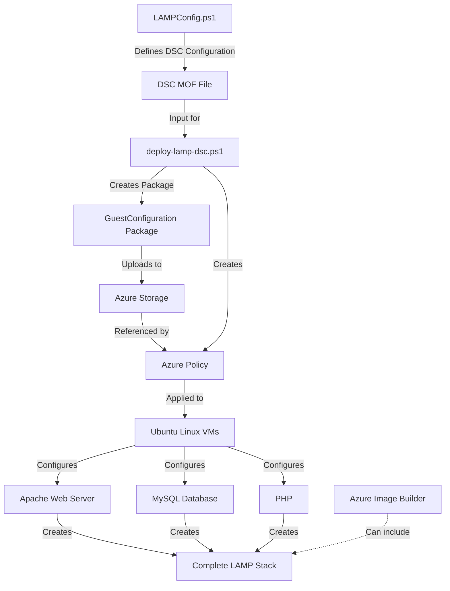

# Ubuntu LAMP Server Configuration Scripts

This folder contains PowerShell scripts for configuring and deploying a LAMP (Linux, Apache, MySQL, PHP) stack on Ubuntu Linux virtual machines in Azure. These scripts utilize Azure Guest Configuration to ensure compliance and automate the configuration of your Linux VMs.

## Files in this Directory

- **LAMPConfig.ps1**: DSC (Desired State Configuration) script that defines the LAMP stack configuration
- **deploy-lamp-dsc.ps1**: Deployment script that packages and creates an Azure Policy for LAMP stack enforcement

## LAMP Stack Configuration Workflow

The following diagram illustrates how these scripts work together to deploy and enforce a LAMP stack configuration on Ubuntu Linux VMs:



## Script Functionality

### LAMPConfig.ps1

This script defines a DSC configuration for Ubuntu Linux that:

1. Installs Apache HTTP Server
2. Installs MySQL Server
3. Installs PHP and PHP-MySQL extension
4. Enables and starts both Apache and MySQL services
5. Creates a test PHP file at `/var/www/html/info.php`

### deploy-lamp-dsc.ps1

This script:

1. Sources the LAMPConfig.ps1 script to get the DSC configuration
2. Creates a Guest Configuration package from the DSC configuration
3. Creates an Azure Policy definition that enforces the LAMP configuration
4. Deploys the policy definition to Azure

## Usage

1. Ensure you have the Azure PowerShell module installed
2. Authenticate to your Azure subscription
3. Update the `$contentUri` variable in deploy-lamp-dsc.ps1 with the appropriate SAS URL to your storage
4. Run the deployment script:

```powershell
./deploy-lamp-dsc.ps1
```

5. Assign the policy to your subscription, resource group, or management group

## Integration with Azure Image Builder

These scripts can be used in conjunction with Azure Image Builder to create custom Ubuntu images with a pre-configured LAMP stack. The DSC configuration ensures that the LAMP components are installed and properly configured, while the Azure Policy ensures ongoing compliance and automatic remediation if needed.

## Related Resources

- [Azure Guest Configuration](https://docs.microsoft.com/en-us/azure/governance/policy/concepts/guest-configuration)
- [Desired State Configuration for Linux](https://docs.microsoft.com/en-us/powershell/scripting/dsc/getting-started/lnxgettingstarted)
- [Azure Image Builder](https://docs.microsoft.com/en-us/azure/virtual-machines/image-builder-overview)
