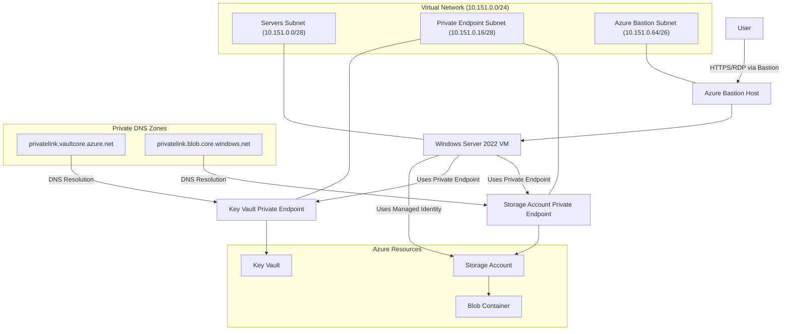

# Azure ARM Template Deployment Guide

This guide provides instructions for deploying the ARM template that creates the following resources in a single resource group:

1. Virtual Network with three subnets:
   - Servers subnet
   - Private Endpoint subnet
   - Azure Bastion subnet

2. Azure Bastion (Standard SKU)

3. Virtual Machine:
   - Windows Server 2022 Datacenter x64 Gen2
   - System-assigned managed identity
   - Microsoft Entra ID login enabled
   - No public IP
   - Secondary data disk
   - AzCopy automatically installed via CustomScriptExtension

4. Key Vault (Standard SKU):
   - Private endpoint enabled
   - Public access disabled

5. Storage Account:
   - Private endpoint enabled
   - Public access disabled
   - Container for SharePoint content created automatically
   - VM has Storage Blob Data Owner and Storage Account Contributor access

## Architecture Diagram



## Prerequisites

- Azure subscription
- Existing resource group
- Azure CLI or Azure PowerShell installed

## Deployment Instructions

### Using Azure CLI

```bash
# Login to Azure
az login

# Set your subscription
az account set --subscription "Your Subscription Name or ID"

# Deploy the template
az deployment group create \
  --resource-group myResourceGroup \
  --template-file template.json \
  --parameters parameters.json
```

### Using Azure PowerShell

```powershell
# Log out from existing connection
Disconnect-AzAccount
# Login to Azure
Connect-AzAccount -TenantId "xxxxxxxx" -Subscriptionid "xxxxxxxx" -UseDeviceAuthentication

# Set your subscription
Set-AzContext -Subscription "Your Subscription Name or ID"

# Deploy the template
New-AzResourceGroupDeployment `
  -ResourceGroupName myResourceGroup `
  -TemplateFile template.json `
  -TemplateParameterFile parameters.json
```

## Parameters

The following parameters can be customized in the parameters.json file:

| Parameter | Description | Default Value |
|-----------|-------------|---------------|
| resourceGroupName | Name of the existing resource group | myResourceGroup |
| vnetName | Name of the virtual network | myVNet |
| vnetAddressPrefix | Address space for the virtual network | 10.151.0.0/24 |
| subnet1Name | Name of the first subnet | servers |
| subnet1Prefix | Address prefix for the first subnet | 10.151.0.0/28 |
| subnet2Name | Name of the second subnet | PrivateEndpoint |
| subnet2Prefix | Address prefix for the second subnet | 10.151.0.16/28 |
| bastionSubnetPrefix | Address prefix for the Azure Bastion subnet | 10.151.0.64/26 |
| vmName | Name of the virtual machine | myVM |
| vmSize | Size of the virtual machine | Standard_D4s_v3 |
| dataDiskSizeGB | Size of the data disk in GB | 128 |
| keyVaultName | Name of the Key Vault | volk071kv2025 |
| storageAccountName | Name of the Storage Account | volk071sa2025 |
| containerName | Name of the blob container | spoarchive |
| bastionName | Name of the Azure Bastion resource | myBastion |
| adminUsername | VM administrator username | AzureUser |
| adminPassword | VM administrator password | (secure string) |

## Post-Deployment Steps

After deployment is complete:

1. Connect to the VM using Azure Bastion
2. AzCopy is automatically installed to `C:\AzCopy` and added to the system PATH
3. Use the VM's managed identity to synchronize content from SharePoint to Azure Storage:

```powershell
# Test connectivity to the storage account
Resolve-DnsName -Name <storageAccountName>.blob.core.windows.net

# Login to AzCopy with VM's managed identity
azcopy login --identity

# Create container if it doesn't exist (already done by template)
# azcopy make 'https://<storageAccountName>.blob.core.windows.net/<containerName>'

# List contents
azcopy list 'https://<storageAccountName>.blob.core.windows.net/<containerName>'

# Sync content from local folder to blob storage
azcopy sync "C:\Temp\sharepoint" "https://<storageAccountName>.blob.core.windows.net/<containerName>" --recursive
```

## Security Features

- **Trusted Launch**: The VM uses Trusted Launch with Secure Boot and vTPM enabled
- **Private Networking**: All resources use private endpoints with no public internet exposure
- **Managed Identity**: The VM uses a system-assigned managed identity for secure, passwordless authentication to Azure resources
- **Role-Based Access Control**: The VM is granted specific RBAC roles to access the storage account
- **Azure Bastion**: Provides secure RDP access to the VM without exposing RDP ports to the internet

## Notes

- The VM is configured with Microsoft Entra ID login, so you can also sign in with your Azure AD credentials
- Access to the VM is provided through Azure Bastion
- Both Key Vault and Storage Account are only accessible through private endpoints
- All resources are deployed in the same region as the resource group
