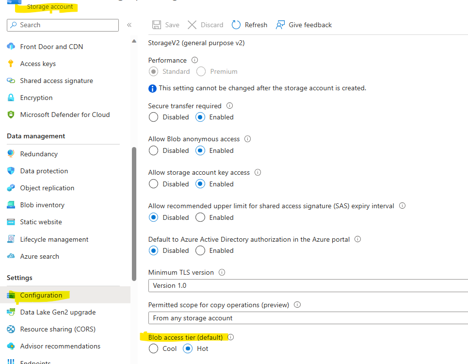

A lifecycle management policy is composed of one or more rules that define a set of actions to take based on a condition being met. For a base blob, you can choose to check one of the following conditions:
- The number of days since the blob was created.
- The number of days since the blob was last modified.
- The number of days since the blob was last accessed. To use this condition in an action, you should first [optionally enable last access time tracking](https://nam06.safelinks.protection.outlook.com/?url=https%3A%2F%2Flearn.microsoft.com%2Fen-us%2Fazure%2Fstorage%2Fblobs%2Flifecycle-management-policy-configure%3Ftabs%3Dazure-portal%23optionally-enable-access-time-tracking&data=05%7C01%7CLeonid.Volkovinskiy%40microsoft.com%7C7f9eef9124e447fe98c208dbab47419a%7C72f988bf86f141af91ab2d7cd011db47%7C1%7C0%7C638292094822621685%7CUnknown%7CTWFpbGZsb3d8eyJWIjoiMC4wLjAwMDAiLCJQIjoiV2luMzIiLCJBTiI6Ik1haWwiLCJXVCI6Mn0%3D%7C3000%7C%7C%7C&sdata=dYKIZ7SV0I9dSZLOZW%2BwZDZys43DifNliys0dLqDS74%3D&reserved=0)

Reference links:

[Configure a lifecycle management policy - Azure Storage | Microsoft Learn](https://nam06.safelinks.protection.outlook.com/?url=https%3A%2F%2Flearn.microsoft.com%2Fen-us%2Fazure%2Fstorage%2Fblobs%2Flifecycle-management-policy-configure%3Ftabs%3Dazure-portal&data=05%7C01%7CLeonid.Volkovinskiy%40microsoft.com%7C7f9eef9124e447fe98c208dbab47419a%7C72f988bf86f141af91ab2d7cd011db47%7C1%7C0%7C638292094822621685%7CUnknown%7CTWFpbGZsb3d8eyJWIjoiMC4wLjAwMDAiLCJQIjoiV2luMzIiLCJBTiI6Ik1haWwiLCJXVCI6Mn0%3D%7C3000%7C%7C%7C&sdata=x1PVvOqNuLLaautDIH4Gx6%2BuWKkTdQ6mFYAcUlU3TRc%3D&reserved=0)

[Optimize costs by automatically managing the data lifecycle - Azure Storage | Microsoft Learn](https://nam06.safelinks.protection.outlook.com/?url=https%3A%2F%2Flearn.microsoft.com%2Fen-us%2Fazure%2Fstorage%2Fblobs%2Flifecycle-management-overview&data=05%7C01%7CLeonid.Volkovinskiy%40microsoft.com%7C7f9eef9124e447fe98c208dbab47419a%7C72f988bf86f141af91ab2d7cd011db47%7C1%7C0%7C638292094822621685%7CUnknown%7CTWFpbGZsb3d8eyJWIjoiMC4wLjAwMDAiLCJQIjoiV2luMzIiLCJBTiI6Ik1haWwiLCJXVCI6Mn0%3D%7C3000%7C%7C%7C&sdata=ykt2IeF%2F4LAe63qgCbObKtxOemp9ebeY8tEOpcCct0w%3D&reserved=0)

Once you configure the lifecycle management policy. If the data stored or moved to cool, cold and Archive Tiers, the data should be stored for a minimum of **30, 90 and 180 days** respectively. 

A blob in the cool tier in a general-purpose v2 account is subject to an early deletion penalty if it's deleted or moved to a different tier before 30 days has elapsed. For a blob in the cold tier, the deletion penalty applies if it's deleted or moved to a different tier before 90 days has elapsed. This charge is prorated. For example, if a blob is moved to the cool tier and then deleted after 21 days, you'll be charged an early deletion fee equivalent to 9 (30 minus 21) days of storing that blob in the cool tier.
Data must remain in the archive tier for at least 180 days or be subject to an early deletion charge. For example, if a blob is moved to the archive tier and then deleted or moved to the hot tier after 45 days, you'll be charged an early deletion fee equivalent to 135 (180 minus 45) days of storing that blob in the archive tier.

Please make sure to configure LCM policy to avoid early deletion penalty.

Reference Link: [Access tiers for blob data - Azure Storage | Microsoft Learn](https://nam06.safelinks.protection.outlook.com/?url=https%3A%2F%2Flearn.microsoft.com%2Fen-us%2Fazure%2Fstorage%2Fblobs%2Faccess-tiers-overview%23default-account-access-tier-setting&data=05%7C01%7CLeonid.Volkovinskiy%40microsoft.com%7C7f9eef9124e447fe98c208dbab47419a%7C72f988bf86f141af91ab2d7cd011db47%7C1%7C0%7C638292094822621685%7CUnknown%7CTWFpbGZsb3d8eyJWIjoiMC4wLjAwMDAiLCJQIjoiV2luMzIiLCJBTiI6Ik1haWwiLCJXVCI6Mn0%3D%7C3000%7C%7C%7C&sdata=gWC%2BqbVVKTb4MbW6HsBxaLfT8P1OnvcpJqL1%2B%2F6%2FshU%3D&reserved=0)

Please note that, Storage accounts have a default access tier setting that indicates the online tier in which a new blob is created. The default access tier setting can be set to either hot or cool. Users can override the default setting for an individual blob when uploading the blob or changing its tier. 
The default access tier for a new general-purpose v2 storage account is set to the hot tier by default. You can change the default access tier setting when you create a storage account or after it's created. If you don't change this setting on the storage account or explicitly set the tier when uploading a blob, then a new blob is uploaded to the hot tier by default.

Note: Lifecycle management polices cannot be applied to change the default access tier of the Storage account.
A blob that doesn't have an explicitly assigned tier infers its tier from the default account access tier setting. If a blob's access tier is inferred from the default account access tier setting, then the Azure portal displays the access tier as **Hot (inferred)** or **Cool (inferred)**. Changing the default access tier setting for a storage account applies to all blobs in the account for which an access tier hasn't been explicitly set.

[Reference link](https://learn.microsoft.com/en-us/azure/storage/blobs/access-tiers-overview#default-account-access-tier-setting)
