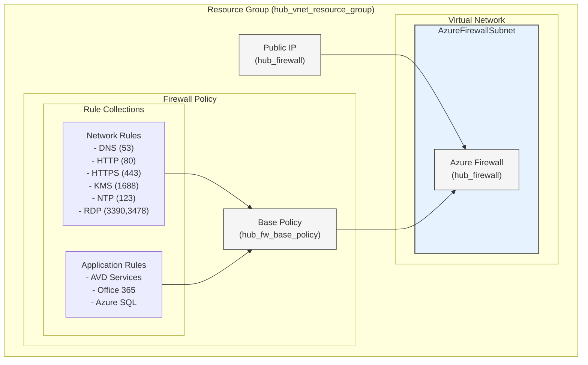

# Azure Firewall Infrastructure Diagram

```mermaid
graph TD
    %% Style definitions
    classDef subnet fill:#e6f3ff,stroke:#666,stroke-width:2px
    classDef resource fill:#f5f5f5,stroke:#333,stroke-width:1px

    %% Resource Group container
    subgraph RG["Resource Group (hub_vnet_resource_group)"]
        %% Virtual Network container
        subgraph VNET["Virtual Network"]
            %% Firewall Subnet
            subgraph FW_SUBNET["AzureFirewallSubnet"]
                FIREWALL["Azure Firewall<br>(hub_firewall)"]
            end
        end
        
        %% Stand-alone resources
        PIP["Public IP<br>(hub_firewall)"]
        
        %% Policy container
        subgraph POL["Firewall Policy"]
            FW_POL["Base Policy<br>(hub_fw_base_policy)"]
            subgraph RULES["Rule Collections"]
                NET_RULES["Network Rules<br>- DNS (53)<br>- HTTP (80)<br>- HTTPS (443)<br>- KMS (1688)<br>- NTP (123)<br>- RDP (3390,3478)"]
                APP_RULES["Application Rules<br>- AVD Services<br>- Office 365<br>- Azure SQL"]
            end
        end
    end

    %% Connections
    PIP --> FIREWALL
    FW_POL --> FIREWALL
    NET_RULES --> FW_POL
    APP_RULES --> FW_POL

    %% Apply styles
    class FW_SUBNET subnet
    class FIREWALL,PIP,FW_POL resource
```