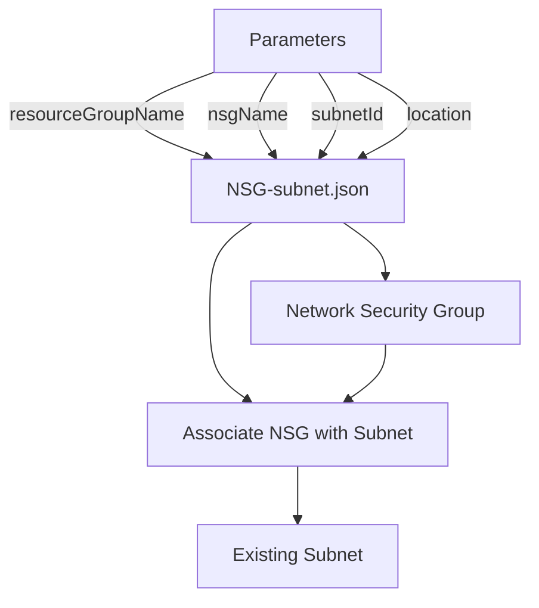

# Network Security Group ARM Template Usage

This ARM template creates a Network Security Group and associates it with an existing subnet in a specified resource group.

## Parameters

- `resourceGroupName`: Name of the existing resource group where the subnet is located
- `nsgName`: Name of the Network Security Group to create
- `subnetId`: Full resource ID of the existing subnet to attach the NSG to
- `location`: Azure region where resources should be deployed

## Example Usage

```bash
az deployment group create \
  --resource-group myResourceGroup \
  --template-file NSG-subnet.json \
  --parameters \
    resourceGroupName="myResourceGroup" \
    nsgName="MyNetworkSecurityGroup" \
    subnetId="/subscriptions/00000000-0000-0000-0000-000000000000/resourceGroups/myResourceGroup/providers/Microsoft.Network/virtualNetworks/myVnet/subnets/mySubnet" \
    location="eastus"
```

## Diagram


